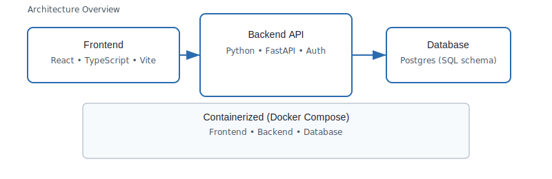

# Stocks Tradeflow — Trading Demo Application



Brief
-----

Stocks Tradeflow is a compact, full-stack demo application showcasing a production-minded trading dashboard. It pairs a Python FastAPI backend with a React + Vite frontend to demonstrate system design, API development, real-time UI patterns, and containerized deployment.

Why this project is relevant to recruiters
----------------------------------------

- Concise, end-to-end system demonstrating backend APIs, database schema, and a modern frontend.
- Emphasizes clean architecture, testing, and containerized development (Docker Compose).
- Highlights technologies and responsibilities useful for screening backend, frontend, and full-stack candidates.

Key Features
------------

- Account and portfolio management APIs (FastAPI)
- Trading UI with real-time price components (React + Vite)
- Docker Compose for one-command local setup
- Clear separation of backend and frontend projects for focused evaluation

Tech Stack
----------

- Backend: Python, FastAPI, SQL (Postgres-compatible schemas), uWSGI/ASGI
- Frontend: React, TypeScript, Vite, Tailwind CSS
- DevOps: Docker, Docker Compose

Quick Start (recommended)
-------------------------

1. Build and start all services locally with Docker Compose:

```bash
docker-compose up --build
```

2. Backend API: http://localhost:8000
3. Frontend: http://localhost:5173

Project Layout (high level)
---------------------------

- `backend/trading-main/` — Python backend, API routes, DB schema and migrations
- `frontend/tradeflow-dashboard-main/` — React + Vite frontend app and components

What to evaluate (for reviewers)
-------------------------------

- API design and error handling: review `backend/trading-main/trading/backend/app/routes`
- Data modeling and SQL schema: see `backend/trading-main/00-schema.sql`
- Frontend component design and state management: see `frontend/tradeflow-dashboard-main/src/components`
- Dockerfile and compose orchestration for reproducible environments

Contributing and running locally
--------------------------------

- Backend: follow `backend/trading-main/README.md` for virtualenv, requirements, and tests
- Frontend: follow `frontend/tradeflow-dashboard-main/README.md` for `npm`/`yarn` dev commands

License
-------

MIT

Contact
-------

If you'd like a walkthrough or a short demo recording for hiring purposes, open an issue or reach out to the project owner.
